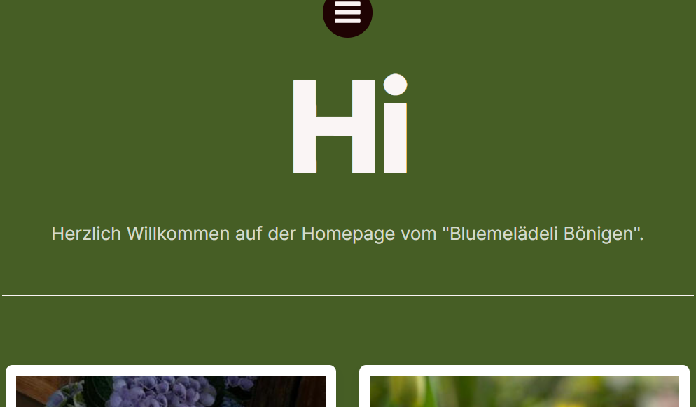

+++
title = "Canvas & eigenes Projekt"
date = "2022-08-30"
draft = false
pinned = false
description = "Canvas zum eigenen Projekt erstellen. Projekt beschreiben und skizzieren."
+++
**Ziel ist,** eine Webseite zu einem gewählten Projekt gestalten. Das Projekt sollte so gewählt werden, dass es realisiert werden kann.

Das Canvas an sich war einfach zu verstehen, jedoch wussten wir nicht welches Thema uns für das Projekt interessiert.

Das folgende Bild ist die Vorlage, welche wir für das Canvas verwendet haben. 

Unsere **erste Idee** war Kuchen backen und verkaufen. Leider hat es uns zu wenig interessiert, so dass wir jetzt ein neues Thema suchen müssen. Das Canvas zu Kuchen backen und verkaufen hat uns gezeigt, dass zu viele negative Aspekte damit verbunden sind.

Als **neue Idee** haben wir uns gedacht, dass wir ein Unternehmen suchen, welches eine neue Webseite will. Wir werden die Webseite nach deren Wünschen gestalten. Wir haben bereits jemanden, den wir kontaktieren möchten. Er ist in der Immobilien Branche tätig und ist an einem neuen Projekt. Unser nächster Schritt wird sein, dass wir mit ihm zusammensitzen und uns mit ihm austauschen.

Um uns mit Webseiten vertraut zu machen kreierten wir eine erste Webseite für einen Blumenladen. Die Webseite ist unter folgendem Link zu finden: [Bluemelädeli Bönigen (blumenlaedeli-boenigen.carrd.co)](https://blumenlaedeli-boenigen.carrd.co/)

Beim kreieren der Webseite gab es einige Schwierigkeiten. Das Verwenden von Buttons, wo weiteres hinterlegt ist, hat nicht funktioniert. Das Tool, mit welchem wir die Webseite gemacht haben, war nicht so umfangreich.

Unser **nächster Schritt** ist, dass wir die neue Idee ausarbeiten.