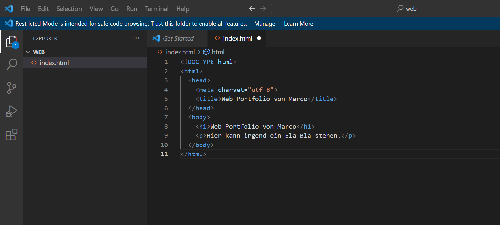

+++
title = "html erste Schritte"
date = "2022-10-25"
draft = false
pinned = false
description = "Auseinandersetzung mit html und css."
+++
Was genau ist html?

Einfach erklärt ist html für das Grundgerüst einer Webseite zuständig.

Was ist css?

Das css ist anders als das html für die Gestaltung der Webseite verantwortlich.

Die folgende Webseite zeigt die ersten Schritte beim Aufbau einer Webseite.

[Teil 1: Unsere erste Webseite | HTML & CSS Tutorial (Deutsch) | code.makery.ch](https://code.makery.ch/de/library/html-css/part1/)

Dies ist der erste Teil. Zuerst muss man Visual Studio Code installieren. Anschließend darauf einen Live Server installieren und einen Ordner erstellen. Weiter Schritte sind auf dem oben genannten Link besser erklärt.

Ich hatte ein wenig Schwierigkeiten mit dem html. Für mich ist es zu komplex und kompliziert.  Trotzdem versuche ich mein Bestes zu geben.

Bevor man mit dem ganzen html und css beginnen kann, braucht man eine bestimmte Basis. 

Wie soll die Webseite aussehen? Was soll inhaltlich auf der Webseite erscheinen?

In unserer Webseite geht es um eine Immobilie in Morgins. Wir können für ein Unternehmen eine Webseite gestalten. 

Folgende Schritte haben wir gemacht:

\    1. Recherche zum Thema/Inhalt der Webseite. 

* Über den Ort Morgins
* Der Tourismus in Morgins
* Über die Immobilien in Morgins

  2. Bilder für die Webseite sammeln. (Bilder zur Immobilie und zum Ort)

  3. Gestaltung, wie soll die Webseite aussehen?
* Beispiele für mögliche Webseite erstellen.
* Skizze, wie ist die Webseite aufgebaut?

Nun sind wir am letzten Schritt: Die Verwirklichung und Präzisierung.