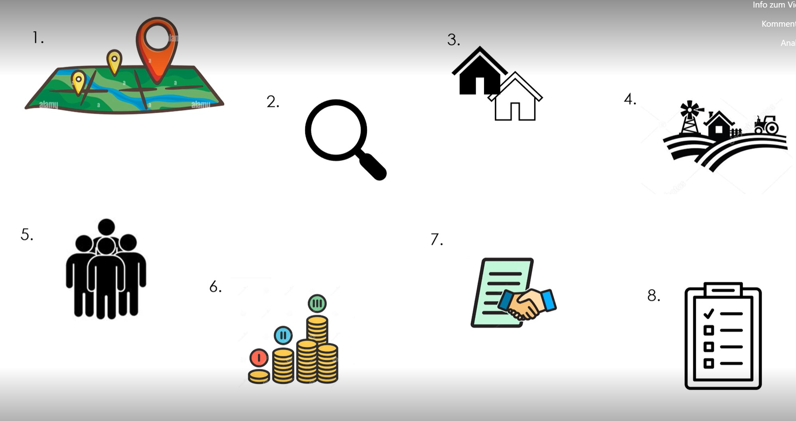

+++
title = "TO-DO beim Kauf deiner Ferienwohnung."
date = "2023-05-14"
draft = false
pinned = false
description = "Bist du dir nicht sicher, auf welche Kriterien du beim Kauf einer Ferienwohnung achten solltest?\nIn einem Kurzen Erklärvideo kannst du dir JETZT anschauen was zu tun ist!\nIn diesem Post werde ich dir nochmals näherbringen, welches die wichtigsten Punkte, beim Kauf von deinem Eigenheim sind.\n"
+++
Im Fogenden bringe ich dir die 8 wichtigsten Punkte nochmals näher.

1.  Achte auf die *Lage der Wohnung*

2. Kaufe die Immobilie nicht ohne einen *Besichtigung*

3. Schau die die Wohnung nicht nur von innen, sondern auch das Gebäude von aussen an

4. Betrachte dir die *Umgebung*

5. Informiere dich über die *Nachbarschaft*

6. *Vergleiche den Kaufpreis* mit anderen ähnlichen Wohnungen, die zum Verkauf stehen

7. *Lies den Kaufvertrag* aufmerksam und sorgfältig, bevor du ihn unterschreibst

8. Mach die eine **Checkliste**, von allen Dingen, die du vor dem Wohnungskauf fragen und wissen möchtest

Ich lege dir diese Schritte ans Herz. Damit du dies nicht vergisst, machst die diese 8 Punkte am besten auch auf deine Checkliste. 

Nun bist du optimal für dienen nächsten Wohnungskauf vorbereitet. Ich hoffe dir haben meine Tipps gefallen. Zum nachschauen findest du das Video in unserem Projektordner.